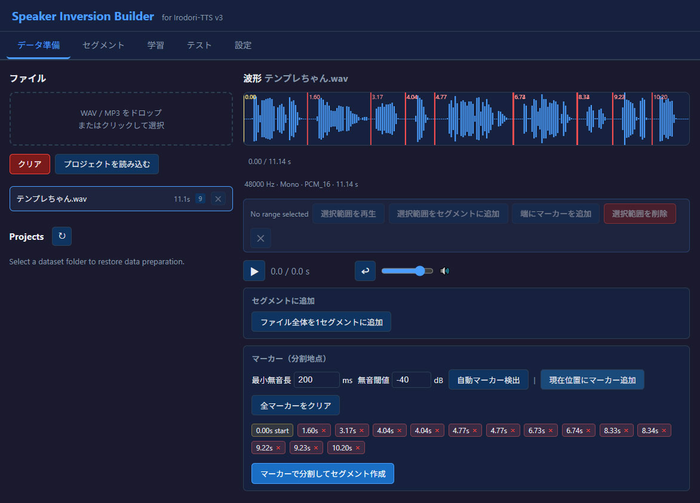
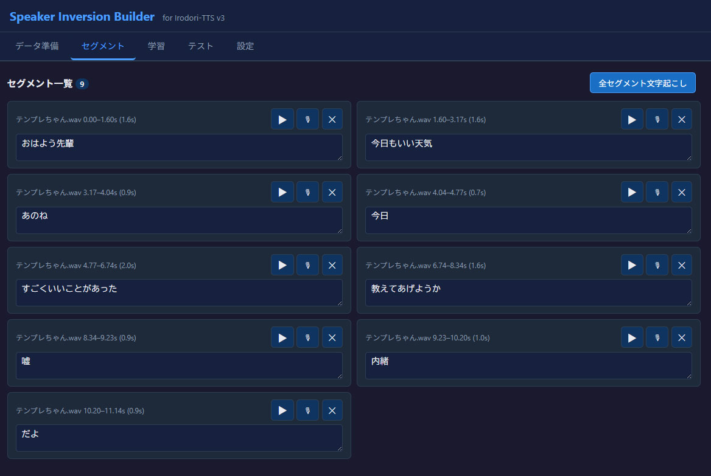
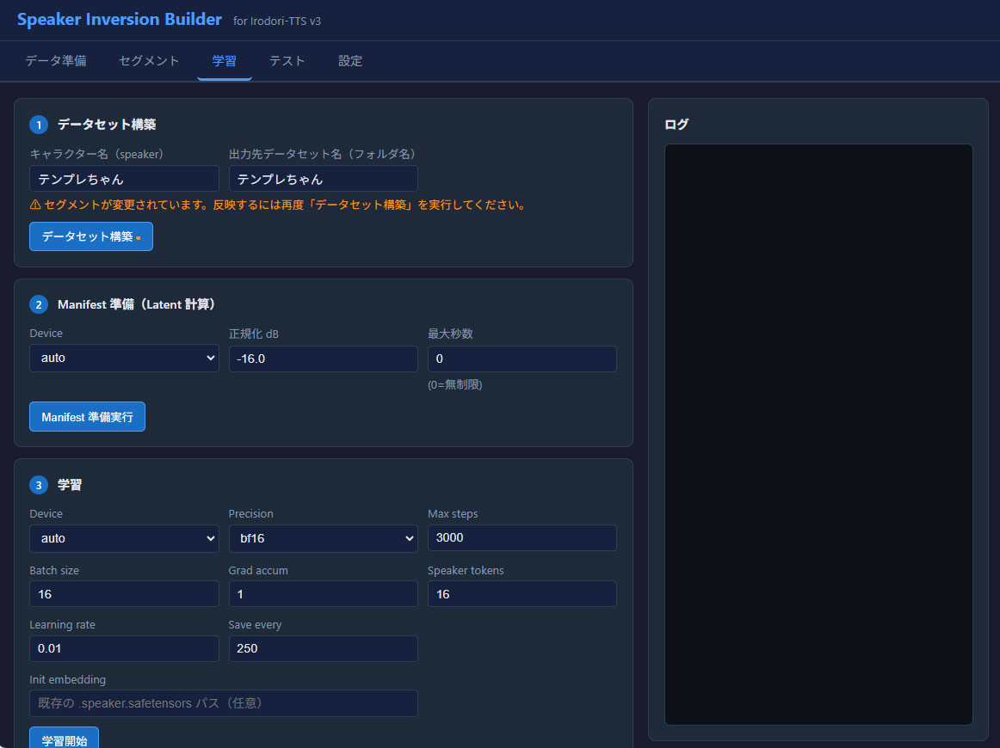
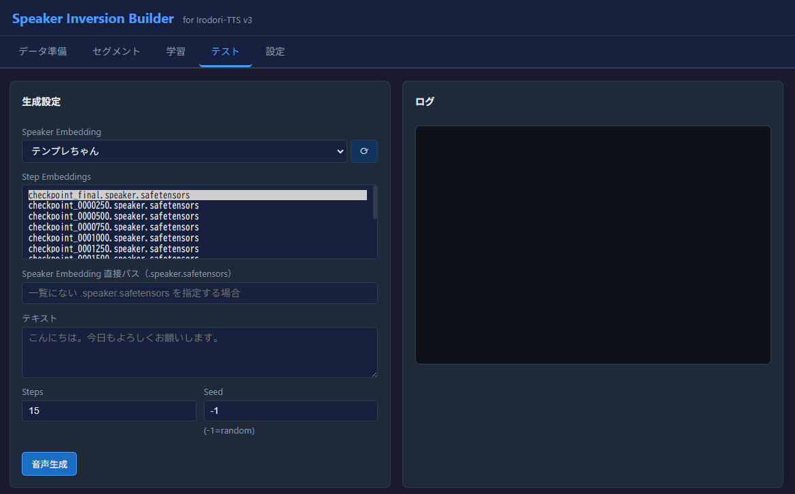

# Speaker Inversion Builder WebUI for Irodori-TTS v3

Irodori-TTS v3 の Speaker Inversion 用データセット作成、文字起こし、学習をブラウザから行うためのローカル WebUI です。



## できること

- 音声ファイルの波形を見ながら範囲削除、マーカー分割
- 無音区間からの分割マーカー自動検出
- セグメント単位に分割した音声の文字起こし支援
- faster-whisper による自動文字起こし・一括文字起こし
- 作成したデータセットの再呼び出し(プロジェクト読み込み)
- Speaker Inversion 用データセット構築(Manifest / latent 生成)
- WebUI からの学習実行
- 学習用バッチファイルの雛形生成
- 学習済み speaker embedding を使ったテスト音声生成

## 起動

Windows では以下を実行します。

```bat
run.bat
```

既定では次の URL で起動します。

```text
http://127.0.0.1:7863
```

手動で起動する場合は以下です。

```bat
uv sync --no-dev
uv run --no-sync python webui\app.py --host 0.0.0.0 --port 7863
```

## 初回設定

初回起動時に、学習・生成に使う Irodori-TTS v3 本体フォルダを指定します。

設定画面または初回表示されるダイアログで、以下のような Irodori-TTS v3 のフォルダを指定してください。

```text
C:\path\to\Irodori-TTS-v3
```

`参照` ボタンを押すと、WebUI を実行しているマシン上でフォルダ選択ダイアログを開けます。リモート端末からアクセスしている場合も、ダイアログはサーバー側に表示されます。

## 基本的な使い方

1. **データ準備**
   - WAV / MP3 をアップロードします。
   - 波形上で必要な範囲を選択します。
   - 必要に応じて範囲削除、マーカー追加、自動マーカー検出、分割を行います。
   - 生成済みのデータセットをプロジェクトとして再度読み出しできます。

2. **セグメント**

   - 分割したセグメントごとに学習用に読み上げテキストを入力または修正します。
   - `全セグメント文字起こし` ですべてのセグメントをまとめて自動文字起こしできます。
   - 自動文字起こしで空欄または不正確なテキストとなった音声は手入力で修正してください。
   - 文字起こしはfaster-whisperのCPU推論を使用しています。
   - 起動バッチファイルを修正すればcudaによる推論に変更できますが必要ファイルが増加しvenvが大きくなります。必要に応じて設定してください。

3. **学習**
4. 
   - `データセット構築` を実行します。
   - `Manifest 準備実行` を実行します。
   - `学習開始` を実行します。
   - 学習ログは画面右側に表示されます。
   - 最終的な学習ファイル(embeddings)は outputs/checkpoint_final.speaker.safetensors です。
   (途中の学習経過ファイルも保存されます。問題なければcheckpoint_final 以外は削除してください)
   - embeddings の拡張子は必ず「.speaker.safetensors」としてください

5. **テスト生成**
6. 
   - 学習済み speaker embedding を選択します。
   - テキストを入力して音声生成を実行し学習結果を確認できます。
   - 一覧にない embedding は `Speaker Embedding 直接パス（.speaker.safetensors）` に直接指定できます。

## 出力物

主な出力先は以下です。

```text
data/
  datasets/
    <データセット名>/
      source.jsonl
      project_state.json
      manifest.jsonl
      latents/
      wavs/
      train.bat
      train.sh
  logs/
  uploads/
  segments/

outputs/
  <データセット名>/
    checkpoint_final.speaker.safetensors
```

### 学習済み speaker embedding

WebUI で学習した結果として使う主なファイルはこれです。

```text
outputs/<データセット名>/checkpoint_final.speaker.safetensors
```

テスト生成では、この `.speaker.safetensors` が speaker embedding として使用されます。

### データセット

データセット構築後の作業データは以下に作られます。

```text
data/datasets/<データセット名>/
```

主なファイル:

- `source.jsonl`: 学習用の音声パス、テキスト、speaker 情報
- `project_state.json`: WebUI でデータ準備状態を復元するための状態ファイル
- `manifest.jsonl`: Manifest 準備実行で生成される学習用 manifest
- `latents/`: Manifest 準備実行で生成される latent
- `wavs/`: データセット用にコピーされた音声

### ログ

Manifest、学習、テスト生成のログは以下に保存されます。正常に動作しない場合に参照してください。

```text
data/logs/
```

## train.bat / train.sh

`train.bat` / `train.sh` は、データセットからの再学習を行うサンプルスクリプトです。

WebUI で学習を行った場合は、特に使用する必要はありません。

用途:

- WebUI を使わずに同じデータセットで再学習したい場合
- 学習コマンドを確認したい場合
- パラメータを手修正して試したい場合

生成場所:

```text
data/datasets/<データセット名>/train.bat
data/datasets/<データセット名>/train.sh
```

これらは `データセット構築` 実行時点の設定値で生成されます。設定を変更したあとにスクリプトへ反映したい場合は、再度 `データセット構築` を実行してください。

## 注意事項

- Irodori-TTS v3 本体は別途必要です。またSpeaker Inversionに対応しない旧バージョンでは動作しません。
- Irodori-TTS v3 本体の場所を変更した場合は、WebUI の設定も更新してください。
- 音声デコードで失敗する環境では、full shared FFmpeg build の dllが必要になります。
(必要なのはffmpeg.exe ではなくDLLファイルです。DLLが統合されたessentials buildでは動作しません)
- 日本語を含むデータセット名でも利用できますが、生成された `.bat` を手動実行する場合は文字コードや実行環境の影響を受けることがあります。
- 制作者の環境では（一応）動作しました。環境に依存する部分が大きく、すべての環境で動作することを保証するものではありません。
- 本プロジェクトは生成AIによる成果物を含みます。

## License

MIT License
